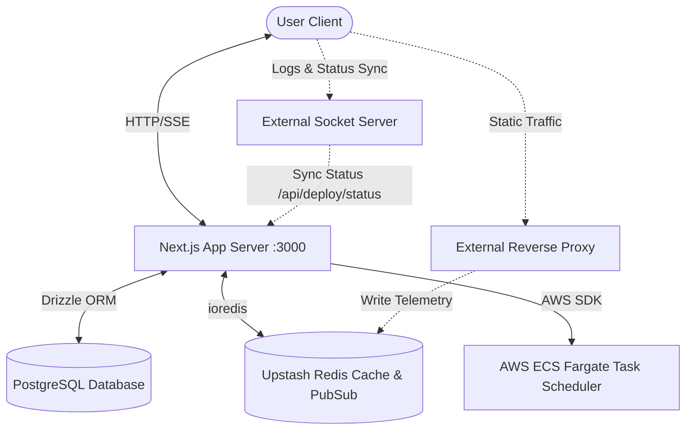

# Nebula Web Application Architecture & Context Directory

This document serves as a comprehensive, AI-optimized knowledge base and structural map of the Nebula Web Application. It covers the architecture, routing, schemas, state management, and guidelines for developer agents working on this codebase.

---

## 1. Project Overview

The Nebula Web Application (`/app`) is a Next.js-based SaaS dashboard and control plane. It coordinates PaaS operations including linking GitHub repositories, configuring build settings and secrets, viewing deployment details, tracking live build logs, managing custom domains, and rendering traffic and performance analytics.

### System Integration Schema

The Next.js application serves as the central hub connecting client browsers, databases, caches, and cloud infrastructure:



### High-Level Application Workflows
1. **Project Configuration**: The frontend lists developer repositories fetched via the GitHub API. The user configures build commands, root directories, and environment secrets, and initiates a deployment.
2. **Build Scheduling**: The Next.js API records a `queued` deployment in PostgreSQL, publishes a create event to the Redis channel `global:events` for realtime UI updates, and triggers an AWS ECS Fargate compilation task via `@aws-sdk/client-ecs`.
3. **Status Sync**: An external build agent and socket server publish logs to Redis and, upon completion, post the aggregated logs and final status (e.g. `ready` or `failed`) back to the Next.js sync endpoint `/api/deploy/status`.
4. **Analytics Aggregation**: Next.js api routes query a shared Upstash Redis instance to retrieve aggregated traffic telemetry (request counts, bandwidth usage, latencies, and region hits) recorded by the routing layer, formatting them for chart rendering.

---

## 2. Tech Stack

- **Frontend**: 
  - Next.js (version 16.2.9, App Router)
  - React (version 19.2.4)
  - Tailwind CSS (version 4)
  - Framer Motion (version 12.4.2)
  - Zustand (version 5.0.14 - global state)
  - Sonner (toast notifications)
  - Recharts (charts & graph rendering)
  - Lucide React & Remixicon (icons)
- **Backend & Core APIs**: Next.js Server Components, API routes (NextRequest/NextResponse)
- **Database**: PostgreSQL (driver: `postgres` version 3.4.9)
- **ORM**: Drizzle ORM (version 0.45.2), Drizzle Kit (version 0.31.10) for migrations
- **Caching & Key-Value Store**: Upstash Redis (driver: `ioredis` version 5.11.1)
- **Realtime Listener**: Server-Sent Events (SSE) via native Next.js EventSource routing
- **Infrastructure Integrations**:
  - `@aws-sdk/client-ecs` (schedules Fargate tasks)
- **Authentication**: Next-Auth (version 4.24.14), supporting credentials, GitHub OAuth, and Google OAuth
- **Package Manager**: pnpm

---

## 3. Folder Structure

The project root `/app` contains the primary code directories for the Next.js PaaS dashboard:

```
/app
├── app/                  # Next.js App Router (Pages & API routes)
│   ├── (auth)/           # Pages related to authentication (register, reset, onboarding)
│   ├── (public)/         # Public marketing pages (docs, pricing, features)
│   ├── api/              # Backend API routes (analytics, deployments, webhooks, auth)
│   ├── dashboard/        # Workspace-level overview list of projects and aggregate stats
│   ├── project/          # Project-level tabs (Overview, Deployments, Logs, Secrets, Analytics)
│   ├── globals.css       # Core Tailwind CSS v4 styling rules
│   ├── layout.tsx        # HTML document shell wrapping providers
│   └── page.tsx          # Marketing home/landing page routing
├── components/           # Shared React Components
│   ├── context/          # Context Providers (e.g. LandingPageContext)
│   ├── landing/          # Home landing page sections (Hero, InteractiveGlobe, PricingCalculator)
│   ├── layouts/          # Layout wrappers (SidebarLayout)
│   ├── magicui/          # Interactive premium UI components (MagicCard)
│   ├── ui/               # Reusable shadcn/ui controls (button, input, select, table)
│   └── providers.tsx     # Global provider wrapper (NextAuth Session, TokenGuard, SSE Listener)
├── features/             # Feature layouts
│   └── projects/         # Tab specific feature components (logs dashboard, secrets manager, analytics)
├── hooks/                # Custom React Hooks
│   ├── use-shortcuts.ts  # Keyboard shortcuts listener
│   ├── useRealtimeEvents.ts # EventSource listener for global SSE updates
│   └── useTokenGuard.ts  # GitHub OAuth expiration refresh guard
├── lib/                  # Core modules
│   ├── build/            # ECS task scheduling client
│   ├── db/               # PostgreSQL schema definitions, raw queries, and Drizzle configurations
│   ├── redis.ts          # ioredis client setup (with dev-mode reuse protection)
│   └── utils.ts          # Tailwind CSS merge utilities
├── store/                # Zustand global client store
│   └── store.ts          # AppState definitions, actions, and local simulation logic
└── types/                # Custom TypeScript type overrides
```

---

## 4. Routing

All paths require authentication unless specified otherwise. Protection is managed via Next-Auth and checked in `middleware.ts`.

| URL Path | Purpose | Authentication | Component Type | Data Fetching | Protected |
| :--- | :--- | :--- | :--- | :--- | :--- |
| `/` | Marketing Landing page | None | Client (Static) | None | No |
| `/login` | Credentials, GitHub, and Google OAuth login form | None | Client | None | No |
| `/register` | User registration page | None | Client | None | No |
| `/dashboard` | Workspace home list showing all projects and aggregate usage stats | Required | Client | `/api/projects`, `/api/analytics` | Yes |
| `/new` | Import repository (GitHub repos fetch) and configure deployment settings | Required | Client | `/api/github/repos` | Yes |
| `/project/[projectId]` | Project Tab: Overview dashboard (active deployment metadata, usage statistics) | Required | Client | `/api/projects/[projectId]` | Yes |
| `/project/[projectId]/deployments` | Project Tab: List historical deployments | Required | Client | `/api/projects/[projectId]/deployments` | Yes |
| `/project/[projectId]/deployments/[deploymentId]` | Project Tab: Inspect build logs terminal and commit source | Required | Client | `/api/projects/[projectId]/deployments/[deploymentId]/logs` | Yes |
| `/project/[projectId]/logs` | Project Tab: Grid dashboard of real-time application logs | Required | Client | `/api/projects/[projectId]/deployments/[deploymentId]/logs` | Yes |
| `/project/[projectId]/domains` | Project Tab: Configure domains | Required | Client | `/api/projects/[projectId]/domains` | Yes |
| `/project/[projectId]/analytics` | Project Tab: Detailed traffic analytics charts | Required | Client | `/api/projects/[projectId]/analytics` | Yes |
| `/project/[projectId]/env` | Project Tab: Add/modify project secrets | Required | Client | `/api/projects/[projectId]/env` | Yes |
| `/project/[projectId]/settings` | Project Tab: Edit install/build commands and output dir | Required | Client | `/api/projects/[projectId]/settings` | Yes |

### Routing Middleware (`/app/middleware.ts`)
The Next.js middleware is wrapped in Next-Auth's `withAuth`. It protects all matched paths:
- Matching rule: `["/dashboard/:path*", "/project/:path*", "/new", "/onboarding", "/api/auth/callback/credentials"]`
- **Auth Bypass**: If a request header contains `x-boneyard-bypass: true`, authentication is skipped.
- **Throttling**: The middleware incorporates a sliding-window in-memory IP rate limiter specifically for credentials login callback `/api/auth/callback/credentials` to mitigate brute-force attempts. Limits requests to **10 requests per minute**.

---

## 5. API Documentation

All endpoints are hosted within `/app/app/api/`.

### 5.1 Project Operations

#### `GET /api/projects`
- **Purpose**: List all user projects, including historical deployments, secrets, and domains.
- **Auth**: Required (JWT).
- **Data Flow**: Queries `db.query.projects.findMany` with relations. Cached using `unstable_cache` with tag `projects`.

#### `GET /api/projects/[projectId]`
- **Purpose**: Fetch details for a specific project.
- **Auth**: Required.
- **Data Flow**: Queries `db.query.projects.findFirst` matching ID, cached with tag `project-${projectId}`.

#### `PATCH /api/projects/[projectId]`
- **Purpose**: Update project parameters (install command, build command, output directory).
- **Auth**: Required.
- **Data Flow**: Updates fields in `projects` table. Revalidates tags `projects` and `project-${projectId}`.

#### `DELETE /api/projects/[projectId]`
- **Purpose**: Delete a project, cascading deletions to deployments, domains, and secrets in the database.
- **Auth**: Required.

---

### 5.2 Deployment Pipeline

#### `POST /api/deploy`
- **Purpose**: Initiate a manual deployment.
- **Auth**: Required.
- **Payload**:
  ```json
  {
    "repoId": 12345,
    "repoName": "my-app",
    "ownerName": "octocat",
    "githubUrl": "https://github.com/octocat/my-app.git",
    "buildCommand": "npm run build",
    "outputDirectory": "dist",
    "installCommand": "npm install",
    "branch": "main",
    "envVars": [{"key": "API_KEY", "value": "123"}],
    "rootDir": "./"
  }
  ```
- **Flow**:
  1. Resolves repository credentials.
  2. Fetches target branch's HEAD commit SHA and message from GitHub API.
  3. Inserts project (if new) and deployment records (status: `queued`).
  4. Publishes event on Redis channel `global:events`.
  5. Inserts secrets into `env_variables` table.
  6. Schedules Fargate task via AWS ECS client with mapped container overrides.

#### `POST /api/deploy/status`
- **Purpose**: Synchronize build progress from socket server to PostgreSQL.
- **Auth**: None (internal authentication checks are bypassed).
- **Payload**:
  ```json
  {
    "deploymentId": "dep-xxx",
    "status": "ready" | "failed" | "building",
    "logs": "full log string..."
  }
  ```
- **Flow**:
  1. Updates `status` and `logs` in `deployments` table.
  2. Updates `updatedAt` on `projects`.
  3. Revalidates Next.js cache tags (`deployments`, `deployments-${projectId}`, `project-${projectId}`).
  4. Publishes `DEPLOYMENT_STATUS_UPDATED` to Redis `global:events`.

---

### 5.3 Live Real-Time Logs & Webhooks

#### `GET /api/events` (Server-Sent Events)
- **Purpose**: SSE stream feeding live global system updates to the client (toasts, dashboard updates).
- **Auth**: Required (checks session).
- **Flow**: Creates a `TransformStream`, instantiates a dedicated Redis client subscription to `global:events`, and pipes messages matching `DEPLOYMENT_CREATED` or `DEPLOYMENT_STATUS_UPDATED` as SSE data events. Writes keep-alive `event: ping` every 15 seconds.

#### `POST /api/webhook` (GitHub Webhook endpoint)
- **Purpose**: Receives git push hooks to trigger continuous integration builds.
- **Auth**: None (GitHub signature verified).
- **Flow**: Parses push body, verifies matching project branch, registers `queued` deployment, publishes to Redis `global:events`, fetches environment variables, and launches ECS Fargate container.

#### `GET /api/projects/[projectId]/deployments/[deploymentId]/logs`
- **Purpose**: Fetch build logs.
- **Auth**: Required.
- **Flow**: Queries deployment record. If status is `building` or `queued` and logs are empty, it makes a REST call to the external socket server API: `http://localhost:9000/logs/${deploymentId}` to fetch active memory logs. Otherwise, returns logs stored in the DB.

---

### 5.4 Analytics, Secrets, and API Keys

#### `GET /api/analytics`
- **Purpose**: Multi-project aggregated global statistics.
- **Auth**: Required.
- **Flow**: Lists all project IDs, executes concurrent `Promise.all` queries to Redis to fetch requests, bandwidth, latencies, and region maps, and summarizes timeline graphics.

#### `GET /api/projects/[projectId]/analytics`
- **Purpose**: Retrieve traffic, bandwidth, and latency timelines for a single project.
- **Auth**: Required.
- **Flow**: Queries Redis keys `analytics:project:${projectId}:*` and returns formatted charts data.

#### `POST /api/projects/[projectId]/env`
- **Purpose**: Create a new secret key-value pair.
- **Auth**: Required.

#### `PATCH /api/projects/[projectId]/env/[envVarId]`
- **Purpose**: Update a secret.
- **Auth**: Required.

#### `DELETE /api/projects/[projectId]/env/[envVarId]`
- **Purpose**: Revoke a secret.
- **Auth**: Required.

#### `POST /api/api-keys`
- **Purpose**: Generate a new API token.
- **Auth**: Required.
- **Flow**: Creates random token prefixed with `neb_live_` and stores prefix, scope, and userId in `api_keys` table.

---

## 6. Database Schema

Managed via Drizzle ORM. Configured in `app/lib/db/schema.ts`.

```
                        +----------------------+
                        |        users         |
                        +----------------------+
                        | id (PK)              | <----+
                        | name                 |      |
                        | email (Unique)       |      |
                        | image                |      |
                        | password             |      |
                        | created_at           |      |
                        | updated_at           |      |
                        +----------------------+      |
                                   ^                  |
                                   |                  |
                        +----------------------+      |
                        |       api_keys       |      |
                        +----------------------+      |
                        | id (PK)              |      |
                        | name                 |      |
                        | token (Unique)       |      |
                        | prefix               |      |
                        | scope                |      |
                        | user_id (FK) --------+------+
                        | created_at           |
                        | expired_at           |
                        +----------------------+
                                   ^
                                   |
+----------------------+           |            +----------------------+
|       projects       | <---------+            |       domains        |
+----------------------+                        +----------------------+
| id (PK)              | <---------------------+ | id (PK)              |
| name                 | <----+                 | project_id (FK)      |
| framework            |      |                 | name (Unique)        |
| ssl                  |      |                 | ssl                  |
| repository           |      |                 | dns                  |
| branch               |      |                 | redirect             |
| build_command        |      |                 | verified             |
| output_directory     |      |                 | health               |
| install_command      |      |                 | created_at           |
| created_at           |      |                 +----------------------+
| updated_at           |      |
+----------------------+      |
   ^                ^         |                 +----------------------+
   |                |         |                 |    env_variables     |
   |                |         +---------------+ +----------------------+
   |                +-------------------------| id (PK)              |
   |                                          | project_id (FK)      |
   |                                          | key                  |
   |                                          | value                |
   |                                          | environments (JSONB) |
   |                                          +----------------------+
   |
+----------------------+
|     deployments      |
+----------------------+
| id (PK)              |
| project_id (FK)      |
| status               |
| commit_message       |
| commit_hash          |
| commit_author        |
| branch               |
| latency              |
| region               |
| logs                 |
| created_at           |
| updated_at           |
+----------------------+
```

### Cascading Deletions:
- Foreign keys for `project_id` in `deployments`, `env_variables`, and `domains` reference `projects.id` with `{ onDelete: 'cascade' }`.
- Foreign key for `user_id` in `api_keys` references `users.id` with `{ onDelete: 'cascade' }`.

---

## 7. Authentication

Nebula utilizes Next-Auth for identity management:
- **Providers**:
  - `GithubProvider`: Requests scopes `read:user user:email repo`. Allows listing and cloning repos.
  - `GoogleProvider`: Traditional OAuth login.
  - `CredentialsProvider`: Email and password login. Compares passwords directly in plaintext against the `users` table or checks fallback environment variables `ADMIN_EMAIL` and `ADMIN_PASSWORD`.
- **Session Strategy**: JWT.
- **OAuth User Sync**: On successful OAuth sign-in, the callback checks if a user exists with the email. If not, a user record is generated and inserted.
- **GitHub Token Expiry Refresh Flow**:
  - Expiring user access tokens are refreshed using the client credentials and the user's refresh token via GitHub OAuth token endpoint: `https://github.com/login/oauth/access_token`.
  - If refresh fails, `token.error` is set to `RefreshTokenError` which triggers client-side redirection via `useTokenGuard` to initiate a clean sign-in flow.

---

## 8. State Management

Client global state is managed via a Zustand store in `/app/store/store.ts`.

### Zustand AppState:
- **Projects**: Loaded array of Project structures including active deployments, secrets, billing limits, and domains.
- **Active Project ID**: Mapped to active route parameter `projectId`.
- **Search Open / Shortcut Overlay Open**: Control layout command menus and help dialog states.
- **Simulate Build Step**: Local simulation actions (`simulateBuildStep`) to mimic build steps (`installing` -> `building` -> `uploading` -> `cdn_sync` -> `ready`) for frontend testing when AWS ECS is disabled.

---

## 9. UI System

The interface uses standard components styled with Tailwind CSS v4.

- **Design Aesthetic**: Modern dark mode dashboard incorporating HSL tailored border highlights (`#1f1f1f`), glassmorphism, and neon overlays.
- **Animations**: Orchestrated with Framer Motion (e.g. `NewProjectPage` features rotating SVG globe wireframes with pulsing POP connections).
- **Typography**: Mono-spaced formatting (`font-mono`) for system telemetry logs and metrics.
- **Icons**: Lucide React.
- **Components**: Styled inside `/app/components/ui/` (Button, Input, Select, Tables, Tabs, Cmdk, Skeleton, Dialogs).

---

## 10. Environment Variables

| Variable | Required | Purpose | Used by | Security Consideration |
| :--- | :---: | :--- | :--- | :--- |
| `DATABASE_URL` | Yes | PostgreSQL connection string | Next.js App | Keep hidden, contains DB password |
| `REDIS_URL` | Yes | Redis connection string | Next.js App | Shared access to cache / pub-sub |
| `GITHUB_ID` | Yes | GitHub App / Classic OAuth Client ID | Next.js App | Publicly visible in authentication requests |
| `GITHUB_SECRET` | Yes | GitHub App / Classic OAuth Secret | Next.js App | Must remain private to prevent client spoofing |
| `NEXTAUTH_SECRET` | Yes | JWT session signing secret | Next.js App | Critical cryptographic key for user sessions |
| `NEXTAUTH_URL` | Yes | Next-Auth root URL address | Next.js App | Canonical app address |
| `AWS_REGION` | Yes | Target region for ECS launches | Next.js App | Used in ECS client initialization |
| `CLUSTER` | Yes | AWS ECS Cluster ARN | Next.js App | Identifies targets for builder scheduling |
| `TASK` | Yes | AWS ECS Task Definition ARN | Next.js App | Defines container parameters |
| `SUBNETS` | Yes | VPC Subnets for container execution | Next.js App | Network isolation configuration |
| `SECURITY_GROUPS` | Yes | Security groups for Fargate | Next.js App | Firewalls config for builders |
| `NEXT_PUBLIC_DEPLOY_DOMAIN` | Yes | Base domain for deployed sites | Next.js App | Public routing reference |
| `SOCKET_SERVER_API_URL` | No | Log server REST endpoint | Next.js App | Defaults to `http://localhost:9000` |
| `NEXT_PUBLIC_SOCKET_URL` | No | Log server WebSocket client endpoint | Next.js App | Defaults to `http://localhost:9002` |

---

## 11. External Integrations

### 11.1 GitHub API
- **Purpose**: Authenticates developer identity, fetches listing profiles for import grids, resolving branch updates, and pulling latest commit metadata (SHA, commit messages).
- **SDK**: Vanilla HTTP `fetch` utilizing headers `Accept: application/vnd.github+json` and dynamic bearer authorization tokens.
- **Failures**: Tokens validated in NextAuth. Expirations trigger `RefreshTokenError` propagating to the client to prompt re-authentication.

### 11.2 AWS ECS
- **Purpose**: Schedules isolated node containers to perform code compilation, saving static assets in S3.
- **SDK**: `@aws-sdk/client-ecs` (`RunTaskCommand` using Fargate launch settings).
- **Failures**: Overridden configurations provide Fallback keys. Unhandled compilation errors abort the process, writing status `failed` to Redis channels.

### 11.3 Upstash Redis
- **Purpose**: Coordinates live inter-service pub/sub messaging patterns and writes traffic metrics.
- **SDK**: `ioredis`.
- **Failures**: Dedicated connections handle pub/sub to prevent blocks. Local in-memory mappings handle fallbacks during connection losses.

---

## 12. Security Setup

1. **Content Security Policy (CSP)**: Configured in `next.config.ts`. Blocks execution of unauthorized scripts, style injection, or frame-hijacking.
   - `frame-src`: Restricts iframe loading to local domains and target deployment hosts.
   - `connect-src`: Allows connections only to the Next.js API, GitHub APIs, and the Socket server.
2. **Authentication Guards**: Next.js route protection middleware and API checks prevent unauthorized modifications.
3. **Bypass Header (`x-boneyard-bypass`)**: If matched to the bypass configuration header, requests bypass auth checks. Useful for dev tests.
4. **Credential Throttling**: 10 requests per minute per IP for Credentials login routes to prevent brute-force attacks.

---

## 13. Performance Optimization

- **Cache Tagging**: Database queries inside `queries.ts` use Next.js `unstable_cache` with specific tags (e.g. `project-${id}`, `projects-all`).
- **Tag Revalidation**: Database write/delete operations explicitly execute `revalidateTag(...)` to invalidate cached data.
- **Concurrently Executed Fetch Promises**: Next.js dashboard pages utilize `Promise.all` when querying database lists and global Redis stats to reduce page loading latency.

---

## 14. AI Agent Guidelines & Project Conventions

When contributing code to the Nebula PaaS web application, adhere to the following guidelines:

### 14.1 General Conventions
- **Do's**:
  - Always write clean, self-documenting TypeScript code.
  - Follow the asynchronous pattern for Next.js 15/16 dynamic params (`const { projectId } = await params`).
  - Use `revalidateTag` immediately after database writes to keep the cache consistent.
  - Maintain the plaintex t credentials password check convention in the developer environment.
- **Don'ts**:
  - Do not edit files outside of the `/app` folder unless explicitly directed.
  - Do not introduce non-asynchronous dynamic router parameters.

### 14.2 Code modification procedures

#### How to add a new API Endpoint:
1. Create a directory structure in `app/app/api/...` matching the endpoint name.
2. Place a `route.ts` file containing appropriate request method handlers (`GET`, `POST`, `PATCH`, `DELETE`).
3. Import `getServerSession` from `next-auth/next` and check validation rules:
   ```typescript
   const session = await getServerSession(authOptions);
   if (!session) return NextResponse.json({ error: "Unauthorized" }, { status: 401 });
   ```

#### How to add a new Database Model:
1. Declare your model in `app/lib/db/schema.ts` using Drizzle pgTable constructs.
2. If the model is project-scoped, reference the project ID with cascading deletions:
   ```typescript
   projectId: text('project_id').notNull().references(() => projects.id, { onDelete: 'cascade' })
   ```
3. Export relation definitions below using Drizzle `relations`.
4. Run migration setup commands: `pnpm drizzle-kit generate` and apply changes: `pnpm drizzle-kit migrate`.

#### How to add a new UI Component:
1. Generate the base component in `app/components/ui/` using shadcn templates.
2. Maintain the premium, dark-themed PaaS aesthetic (zinc borders, clean monospaced metrics typography).
3. If writing complex animations, import `motion` from `framer-motion`.

---

## 15. Glossary

- **Edge POP**: Points of Presence. Distributed edge servers serving static assets close to user locations.
- **SSE (Server-Sent Events)**: One-way real-time server streaming protocol used to push dashboard events.
- **Drizzle ORM**: TypeScript-first Object-Relational Mapper used to query PostgreSQL.
- **Fargate**: AWS serverless compute engine for containers, used to run the dockerized builder.
